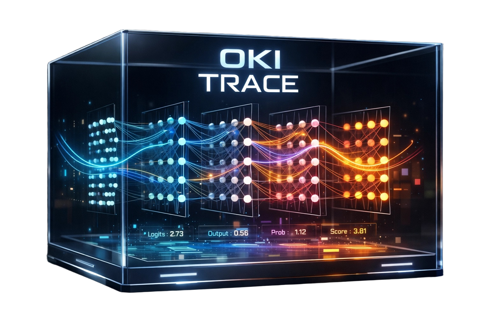

# OKI TRACE: Step-by-step LLM Observability

**See what your LLM does at every step and every layer.**

---

## The Diagnosis

When we send a prompt to a Large Language Model (LLM), we get a response. But we have no idea **how** it arrived at that response. If the output is wrong, biased, or nonsensical, we can't tell if the model misunderstood the prompt, got derailed mid-generation, or was correct until the final token. We are operating in a black box—making debugging and improvement a matter of guesswork, not engineering.

**OKI TRACE** is the diagnostic tool for this problem. It is a **local-first, zero-configuration** observability dashboard that gives you a complete, **step-by-step and layer-by-layer** trace of your model's execution. It is  a demo. 

---
## Why We Built This

There was no single place where you could **chat** with a model and **inspect** its internals (logits, attention, Logit Lens) for each reply. OKI TRACE is that unified dashboard—chat and trace in one flow.

 
## How OKI TRACE Works

OKI TRACE gives you a simple, powerful way to inspect the inner workings of any **HuggingFace `AutoModelForCausalLM`**–compatible model. Run a local Streamlit dashboard, chat with your model, and visualize the **entire generation process**—every token, every layer, every decision.

**What you see in every trace:**

| Trace Component | What It Shows | Why It Matters |
| --- | --- | --- |
| **Chosen Token** | The exact token generated at the current step. | The ground truth of the model's output. |
| **Logits (Top-K)** | The model's next-token probability distribution. | See what the model *could have* said, and with what confidence. |
| **Attention (Evidence)** | The input tokens that received the most attention. | Understand the "evidence" the model used to make its choice. |
| **Logit Lens** | The predicted token distribution at *each layer*. | See how the final prediction emerges and refines through the model's layers. |

**In the dashboard:** chat with the model, then for any assistant reply click **View trace** to step through each generated token and inspect logits, attention (Evidence), and Logit Lens for every layer. Everything runs **locally**. No telemetry, no cloud. Your model, your data, your machine.

---

## What v1 Is *Not*

- **Not** a user-facing SDK or integration API—we focus on the core “capture and display” first. Integration (e.g. “add one line to your code”) comes later.
- **Not** reports, analytics, or “improve your conversations”—that builds on top of this.
- **Not** gradient attribution, activation patching, or other advanced interpretability—v1 is logits, attention, and Logit Lens only.

---

## Tech (v1)

- **Models:** Any HuggingFace `AutoModelForCausalLM` (Qwen, Llama, Mistral, Phi, GPT-2, etc.). Set the Model ID in the dashboard or pass `model_id` to `load_model_and_tokenizer()`. 4-bit is optional with fallback to fp16/bf16.
- **Dashboard:** Streamlit, running locally. Model ID and 4-bit are in the sidebar.
- **Capture:** `output_attentions`, `output_hidden_states` (with fallbacks when a model or its attention backend does not support them). Logit Lens uses a detected final norm + `lm_head`; if not found, it is skipped. Chat: `apply_chat_template` when the tokenizer has a chat template, otherwise a simple `USER: ... ASSISTANT:` fallback.

---

## Summary

We’re building a **local, step-by-step and layer-by-layer trace** of what a language model does when it generates—and a **Streamlit dashboard** to see it. v1 is only that. When that works, we’ll add how others can plug it in and what comes next.
