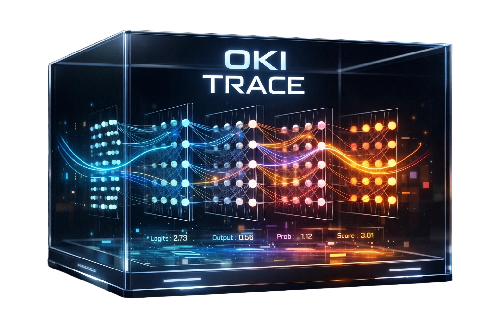

<div align="center">

# OKI TRACE: Step-by-step LLM Observability

**See what your LLM does at every step, every layer, and every component.**



[](https://github.com/skyline-GTRr32/OKI-TRACE)
[](https://github.com/skyline-GTRr32/OKI-TRACE/stargazers)
[](https://github.com/skyline-GTRr32/OKI-TRACE/network/members)
[](https://github.com/skyline-GTRr32/OKI-TRACE/blob/main/LICENSE)
[](https://www.python.org/)
[](https://streamlit.io)
[](https://pytorch.org)

</div>

---

## The Diagnosis

When we send a prompt to a Large Language Model, we get a response. But we have no idea **how** it arrived at that response. If the output is wrong, biased, or nonsensical, we can't tell if the model misunderstood the prompt, got derailed mid-generation, retrieved from a weak memory, or reasoned through incorrect logic. We are operating in a black box — making debugging and improvement a matter of guesswork, not engineering.

**OKI TRACE** is the diagnostic tool for this problem. It is a **local-first, zero-configuration** observability dashboard that gives you a complete, **step-by-step and layer-by-layer** trace of your model's execution — including uncertainty signals, component-level attribution, head ablation, and a trust verdict for every response.

---

## Why We Built This

There was no single place where you could **chat** with a model and **inspect** its internals for each reply — not just logits and attention, but *why* specific layers fired, how confident the model was at each layer, which components actually drove the output, and whether the response came from genuine memory retrieval or uncertain reconstruction. OKI TRACE is that unified dashboard — chat and deep trace in one flow.

---

## What You See in Every Trace

### Core Trace (every token, every step)

| Component | What It Shows | Why It Matters |
|---|---|---|
| **Chosen Token** | The exact token generated at this step | Ground truth of the model's output |
| **Logits (Top-K)** | Next-token probability distribution | See what the model could have said and with what confidence |
| **Attention (Evidence)** | Input tokens that received the most attention at this step | The "evidence" the model used to make its choice |
| **Logit Lens** | Predicted token at each of the 28 layers | See exactly which layer the answer crystallised in |

### Entropy Signals (per token + response summary)

Four uncertainty signals computed per generated token from existing tensors — zero extra forward passes.

| Signal | What It Measures |
|---|---|
| **Token Entropy** | How confident the model is about the next word. Low = certain. High = many options. |
| **Layer Entropy** | Entropy at each layer via logit lens — shows *at which layer* the model resolved uncertainty. A sharp drop = the answer was computed there. |
| **EAS (Entropy Area Score)** | Sum of all layer entropies. Low = uncertainty resolved early. High = model was confused throughout. |
| **Attention Entropy** | How focused vs scattered the model's attention is. Low = locked onto relevant tokens. High = looking everywhere. |

The response-level summary aggregates all of these across every token — mean, peak, and trajectory — so you can see patterns across the full generation, not just one step.

### Direct Logit Attribution (DLA)

DLA decomposes the model's output logit for any token into exact contributions from every component in the network — embedding, each layer's attention, each layer's MLP. This works because transformers use residual connections, so the final hidden state is literally the sum of every component's output. We project each component's contribution through the final norm and lm_head to get its direct effect on the chosen token's logit.

**Per-token DLA** runs for every generated token inside the generation loop. Each step shows which component drove that specific token.

**Response DLA Summary** aggregates across all tokens:
- Top-10 components by total contribution across the full response
- Per-layer MLP vs attention breakdown
- MLP/attention ratio for the whole response
- **DLA Concentration Trajectory** — top-1 component percentage per token, showing whether the model stayed focused (high %) or drifted (dropping %) across the response

**Input Token Attribution** — for the first response token, shows which input words (from the prompt) contributed most to the output, computed via DLA × attention weights.

### Head Ablation

Zero out specific attention heads or entire attention/MLP layers without touching model weights. Done via registered forward hooks that are applied before generation and removed cleanly after.

- Select any layer and any subset of heads to ablate
- Or zero entire attention or MLP layers
- Dashboard runs a **side-by-side comparison** — normal output vs ablated output, each with its own full trace
- DLA during ablated runs reflects the crippled model — hooks are re-applied during every DLA forward pass so the decomposition is honest

This lets you ask: *what breaks when I remove this component?* And see exactly how the model compensates.

### Trust Verdict

A three-signal system that combines entropy, DLA, and response-level MLP ratio into a structured verdict for every response.

```
🟢 Retrieved      — all signals clean, consistent with strong memory retrieval
🟡 Borderline     — one signal flagged, verify if output is critical
🔴 Reconstructed  — multiple signals flagged, model likely stitched from weak signals
⛔ Unstable       — computation was unstable throughout, do not trust output
```

**Signal 1 — Entropy Gate:** If Mean EAS > 200 or Peak token entropy > 6.0 → computation was unstable. This catches cases where the model was genuinely uncertain or looping throughout generation.

**Signal 2 — MLP/Attention Gap:** Computed from the first response token's DLA. Gap = top MLP component % minus top attention component %. High gap (>20%) means one MLP dominated, attention was minor — clean retrieval from stored memory. Low gap (<10%) means attention climbed near MLP level — model was routing through context rather than retrieving a fact.

**Signal 3 — Response MLP Ratio:** If MLP contributed less than 65% of total DLA across the full response, attention was unusually involved throughout — downgrade trust one level.

Each verdict includes per-signal evidence and the exact thresholds applied, so you understand *why* the verdict was reached, not just what it is.

> **Honest scope:** OKI TRACE detects computational uncertainty — whether output came from stored memory (MLP-dominated, focused) or reconstruction from context (attention-infiltrated, distributed). It does **not** detect hallucinations where incorrect information is stored confidently in the model's weights, or where the model reasons correctly through wrong logic. A "Retrieved" verdict means the computation was clean, not that the output is correct. Thresholds are calibrated on 15 labeled examples from DeepSeek-R1-Distill-Qwen-1.5B — treat them as a starting point.

---

## Project Structure

```
trace.py          — traced generation loop: logits, attention, logit lens,
                    entropy signals, per-token DLA, ablation hooks
dashboard.py      — Streamlit UI: chat, trace viewer, trust verdict panel,
                    entropy summary, DLA response summary, ablation sidebar
ablation.py       — head and layer ablation engine, AblationConfig,
                    apply_ablation_hooks, context manager
dla_analyzer.py   — DLA computation: hooks, residual decomposition,
                    input token attribution, find_think_end_token_index
dla_response.py   — response-level DLA aggregation: top-10 components,
                    per-layer breakdown, concentration trajectory
entropy.py        — entropy computation: token entropy, layer entropies,
                    EAS, attention entropy, response summary
trust_scorer.py   — three-signal trust verdict: entropy gate + MLP/attn gap
                    + MLP ratio → Retrieved / Borderline / Reconstructed / Unstable
```

---

## Tech

- **Models:** Any HuggingFace `AutoModelForCausalLM` — Qwen, Llama, Mistral, Phi, GPT-2, DeepSeek, and others. Set the Model ID in the dashboard sidebar or pass `model_id` to `load_model_and_tokenizer()`. 4-bit quantization optional with automatic fallback to fp16/bf16.
- **Dashboard:** Streamlit, running fully locally. No telemetry, no cloud, no API calls. Your model, your data, your machine.
- **Capture:** `output_attentions=True` and `output_hidden_states=True` on the standard HuggingFace forward call. Eager attention implementation preferred so attention weights are returned. Logit Lens uses detected final norm + lm_head — skipped gracefully if not found.
- **DLA:** Forward hooks on every `self_attn` and `mlp` module capture component outputs at the last token position. Decomposition is mathematically exact (residual stream additivity). Verified against actual logits every run — error reported in dashboard.
- **Entropy:** Pure functions on tensors already available from the forward pass. Token entropy from `outputs.logits`, layer entropy from `outputs.hidden_states` projected through norm + lm_head, attention entropy from `outputs.attentions`. Zero extra forward passes.
- **Ablation:** Pre-hooks on `o_proj` zero head slices before the output projection. Post-hooks zero full attention or MLP outputs. No weight mutation. All hooks removed after each run.
- **Trust Scorer:** Pure logic on existing trace data. No model access, no forward passes. Reads `entropy_summary`, `dla_first_response`, and `dla_response_summary` from the trace dict.
- **Thinking support:** `<think>...</think>` blocks parsed from raw output. DLA targets the first real response token after `</think>`, not thinking tokens. Ablated runs that loop inside thinking without closing are handled and labelled honestly in the dashboard.

---

## Honest Limitations

- Thresholds in the trust scorer are calibrated on 15 labeled examples from one 1.5B model. They are a starting point, not a final answer. Recalibrate as you collect more labeled data.
- Per-token DLA doubles the number of forward passes during generation. On a 1.5B 4-bit model expect 3-5x slower generation when DLA is enabled. The `Compute DLA` checkbox in the sidebar controls this.
- DLA is exact in fp16 but approximate in 4-bit quantized models due to numerical instability. Verification error is shown in the dashboard — values below ~0.1 are acceptable.
- The trust scorer cannot detect hallucinations where wrong facts are stored cleanly in model weights, or where the model reasons correctly through incorrect logic. These look identical to correct retrieval from the inside.

---

## Summary

OKI TRACE is a local, step-by-step and layer-by-layer trace of what a language model does when it generates — and a Streamlit dashboard to see it. Every token, every layer, every component, every uncertainty signal, and a structured trust verdict for every response. Everything runs on your machine. Nothing leaves it.
